# Introductie

Dennenappel lampen op internet zijn mooi, maar veel te symmetrisch naar mijn smaak. De echte dennenappel heeft zijn bladen gerangschikt op een bijzondere manier en dit wordt vaak vereenvoudigd voor ontwerp doeleinden. Elk blad groeit vanuit de basis onder een hoek van 137.508 (+/-) graden ten opzichte van het vorige blad. Deze ‘golden angle’ staat het verst af van elke afgeronde verhouding wat maakt dat de bladen zo komen te staan dat er een maximale water/zon vangst is van de harde bladen van de dennenappel (en praktisch alle bladeren van andere planten). Probeer je maar eens in te denken hoe overlappend de bladen gerangschikt zouden zijn wanneer je telkens 1/8e van een cirkel zou draaien t.o.v. het vorige blad, het 9e blad zal dan weer overlappen met het eerste. Ook de bladeren van planten groeien wisselend met deze hoek rond de steel en vangen zo maximaal zonlicht.

Uit frustratie voor de afgezaagde (mathematische) representaties van de echte dennenappel die ik veelvuldig op internet vind, bij pogingen van anderen om er een lamp ontwerp op te baseren, ben ik op onderzoek uitgegaan en heb ik mij verdiept in hoe deze verdeling werkelijk in elkaar steekt.

Ter illustratie hoe nauw deze hoek komt:

# Ontwerp proces

Er zijn iig twee wetmatigheden die de vorm bepalen waarvan er met name één voor mij van belang is. Dit is de plaatsing van de bladen rondom de hartlijn van de lamp. Naast deze wetmatigheid volgt de dennenappel nog een tweede definitie. Als je vanaf de punt van de dennenappel de hoeveelheid bladen per laag telt, dan vind je de Fibonacci reeks [1, 1, 2, 3, 5, 8, 13, …]. Deze reeks maakt dus ook dat de dichtheid van de bladen verhoogd tot het breedste punt en uiteindelijk de oorsprong.

Voor mijn project is alleen de eerste wetmatigheid van belang omdat ik zelf de dichtheid van het bladerdek en de afstand vanaf de hartlijn wil bepalen.

Een 2D representatie van de positionering van de bladen (met gelijke verticale afstand toename van 5mm) helpt me om begrip te krijgen hoe deze 'golden angle' verdeling in zijn werk gaat. Het is heel gaaf dat je kan zien dat de verschillende Fibonacci nummers weer terug te vinden zijn in de hoeveelheid spiralen die je kan tellen onder verschillende hoeken (zie rechts van de schets). Dit klopt alleen voor de 8 elementen om elk element heen, door welke 4 spiralen vormen, de n=2, 5, 8 en 13 spiraal (wat feitelijk een 'spoed' aanduiding is zoals bij een schroefdraad).

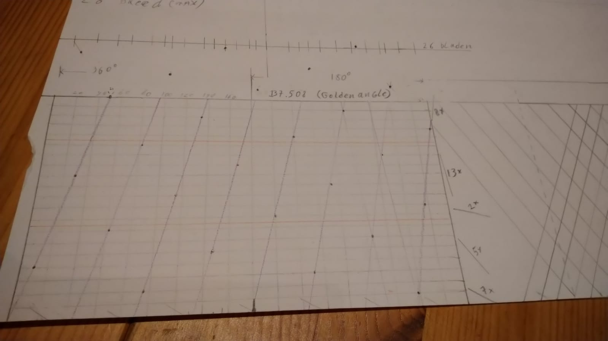

Na met een 3D model te hebben geëxperimenteerd in Solidworks ben ik overgestapt op een schets en wat berekeningen in een [R script](src/main.R). Dit gaf mij de gewenste abstractie en programmeer mogelijkheden.

De vorm van de bladen (in R versimpeld met een scherpe punt, maar in realiteit afgerond met r=1.5) heb ik laten afhangen van waar het blad hangt in de dennenappellamp die ik maak. De bladen zijn op verschillende hoogten en onder verschillende neerwaartse hoeken bedacht. Slechts de rotatie laat ik aan de golden angle over. De wanden van het blad staan onder een hoek zodat de doorgetrokken lijnen zouden snijden in de hartlijn van de lamp. En zo heb ik nog wat regels opgesteld die de vorm definiëren, maar die laat ik hier verder terzijde.

Vanwege de golden angle is de positionering van de bladen dusdanig random dat het niet mogelijk is om met een rib te werken waarop ik de bladen kan monteren (zoals alle andere ‘pinecone lamp’ ontwerpen het aanpakken). Om deze reden heb ik besloten elk blad met een los ijzerdraad te positioneren.

Het bladerdek ziet er straks vanaf de bovenkant zo uit. De bovenste bladen zijn weergegeven in groen, aflopend in rood, donker bruin en licht bruin:

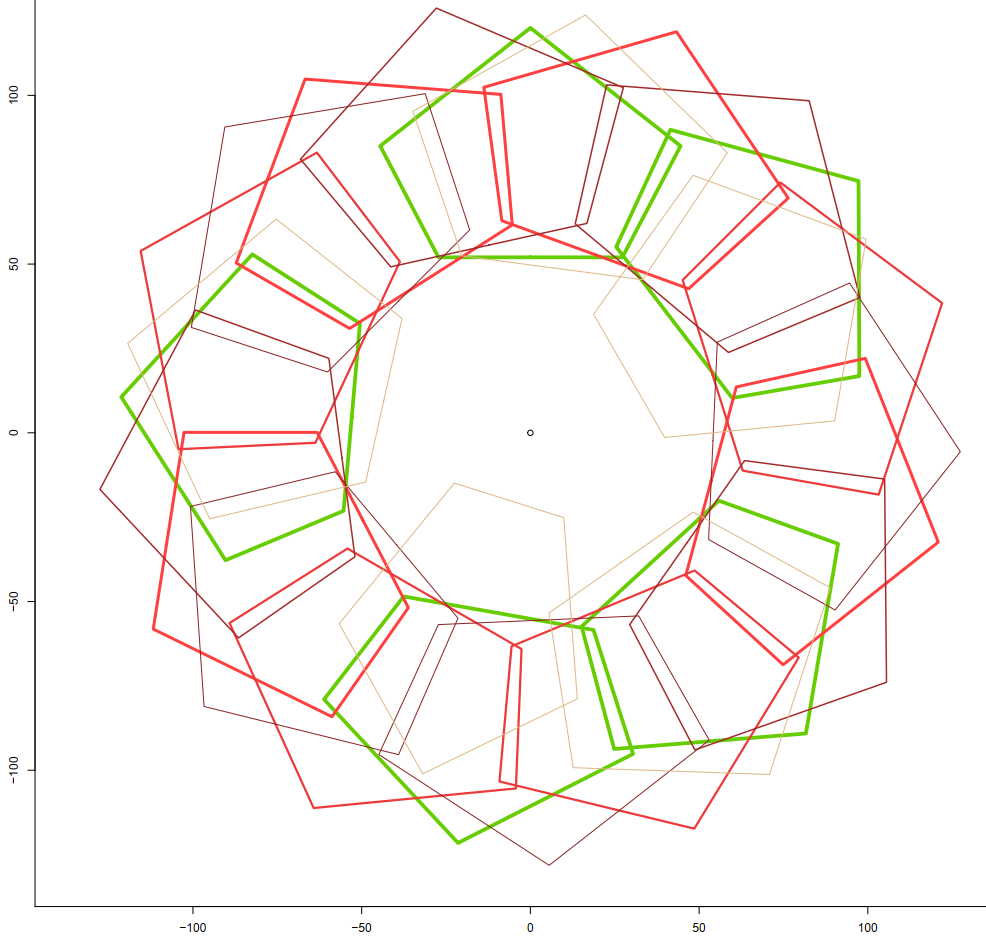

Een vereenvoudigd zijaanzicht (eentje waarbij de rotatie rond de hardlijn niet is meegenomen) ziet er zo uit:

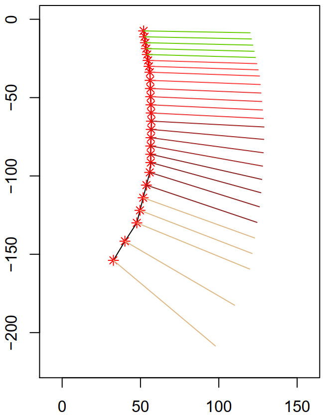

De bladen zelf kan ik ook gewoon plotten om ze vervolgens over te kunnen tekenen op papier. De verkregen papieren mal kan ik dan weer op het fineer en vanaf het uitgeknipte papier op het fineer te zetten.

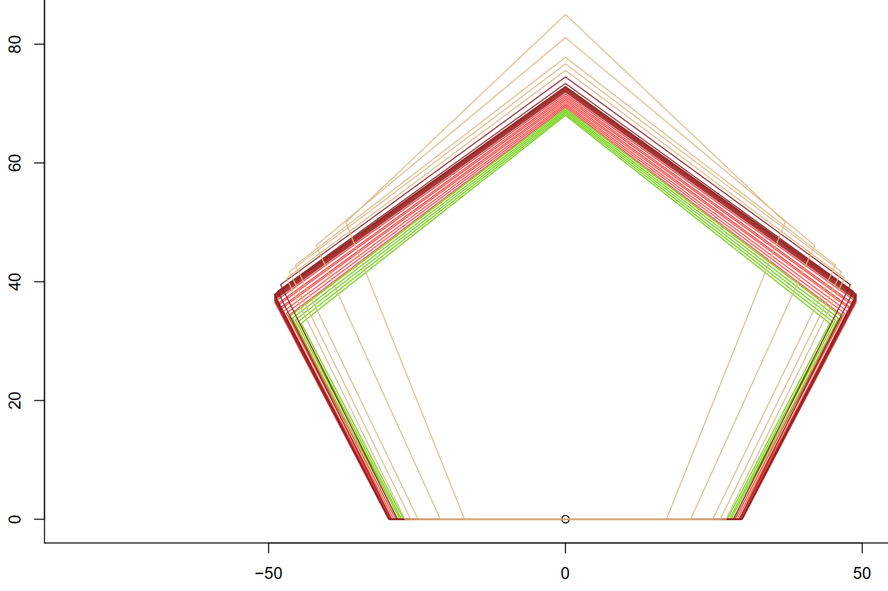

# Aan de slag

Ik heb besloten 26 bladen te maken en deze wil ik een bolling meegeven om het nog natuurlijker te laten ogen. Dit doe ik door 2 lagen fineer op elkaar te lijmen in een mal. Deze mal, waarvan ik er 3 heb gemaakt, zie je op de foto achterin staan en is met stof bekleed.

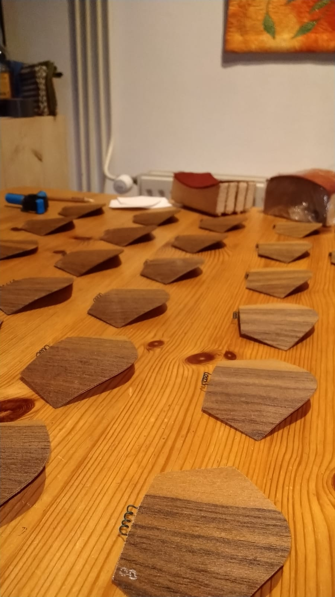

Uit de hand boor ik 26 gaten in een houten schijf op basis van de golden angle waar ik de nummers van de bijbehorende bladen bij noteer.

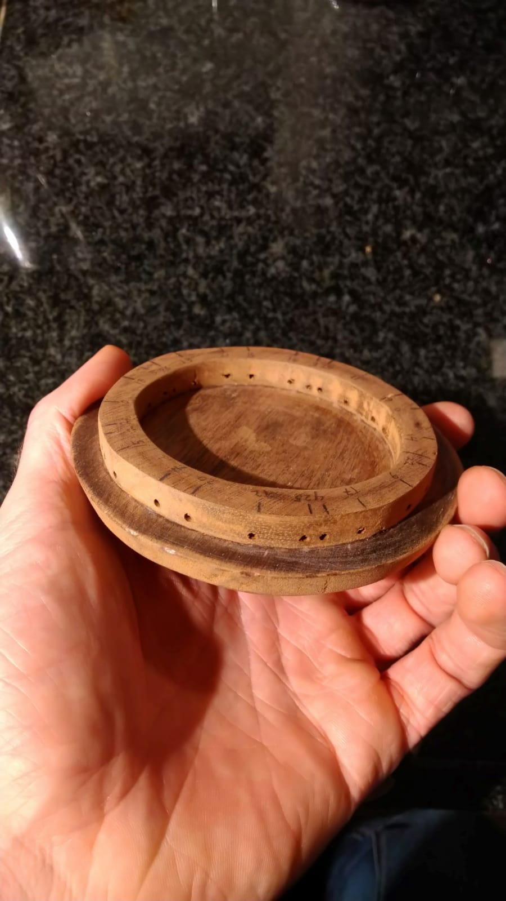

Nu kan ik ook de industrial look 95mm lampen bol en fitting monteren.

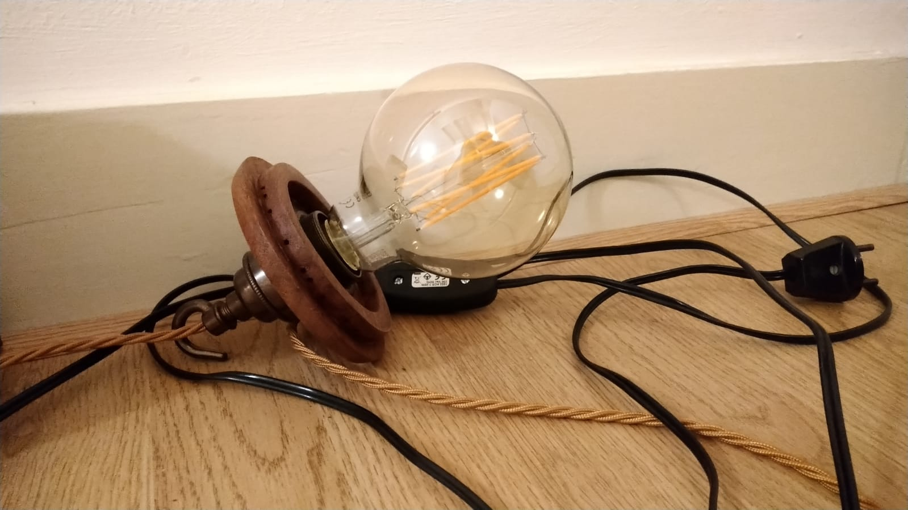

De van fineer gemaakte bladen heb ik geschuurd (wat uit wat experimenten mooier bleek te zijn) en heb ik met blanke lak afgewerkt. Dit zorgt er met name voor dat het hout niet gaat verkleuren door de zon.

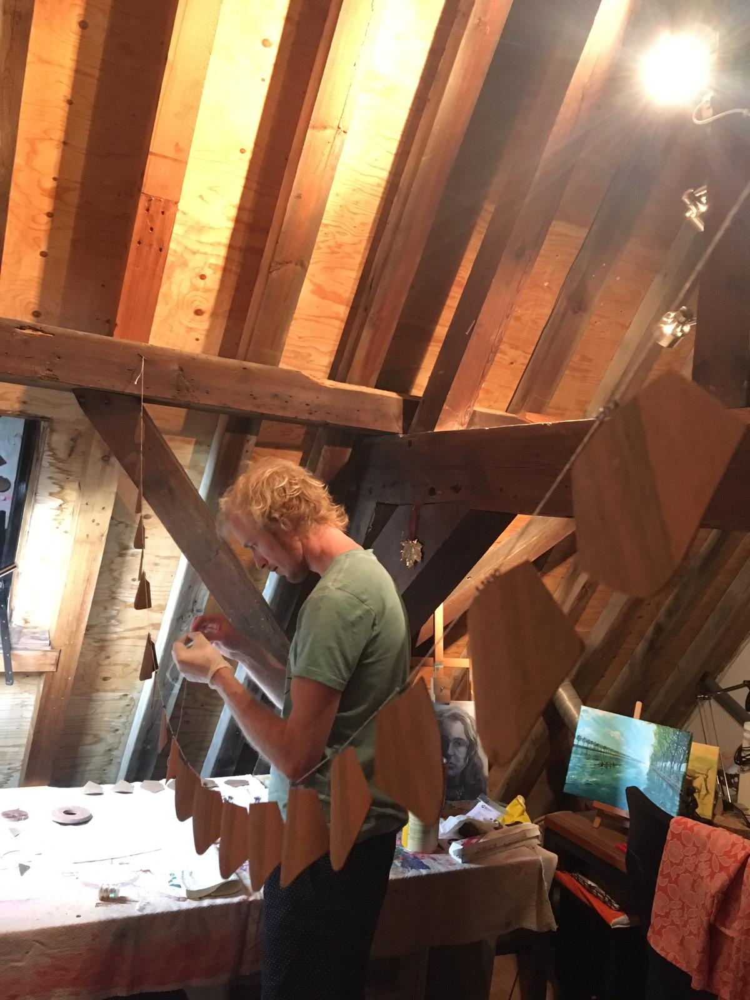

Na het buigen van de ijzerdraden kan ik de eerste bladen ophangen.

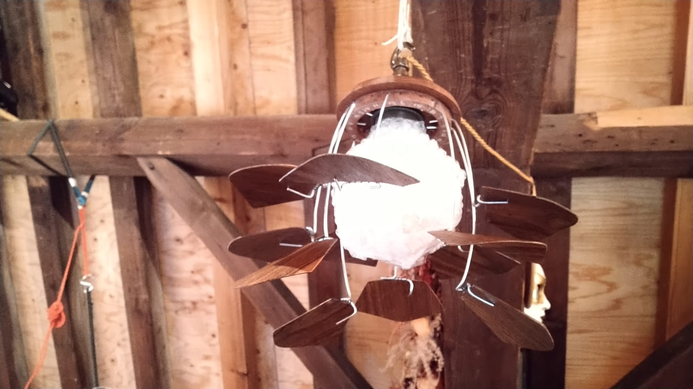

Hier is goed te zien hoe ik de bladen heb voorzien van een spiraal van dun draad zodat ik daar mijn montage mee kan realiseren.

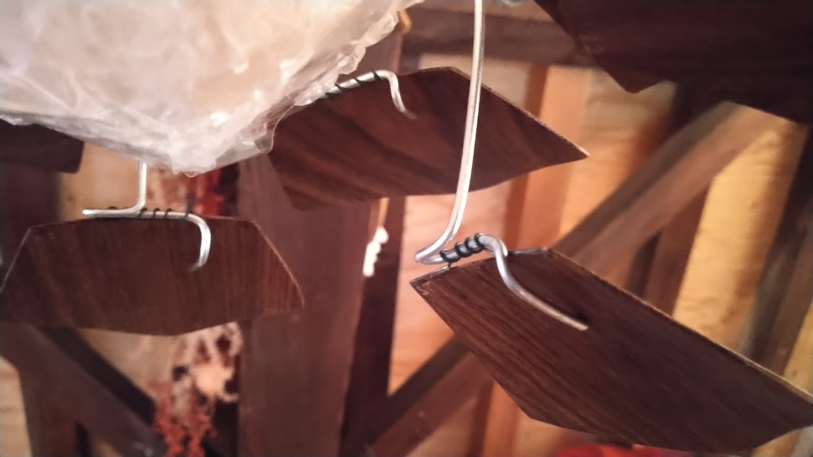

Na alle bladen gemonteerd te hebben moet ik alleen de ‘drop’ of ‘val’ hoek nog wat afstellen om zo het meest esthetische resultaat te behalen.

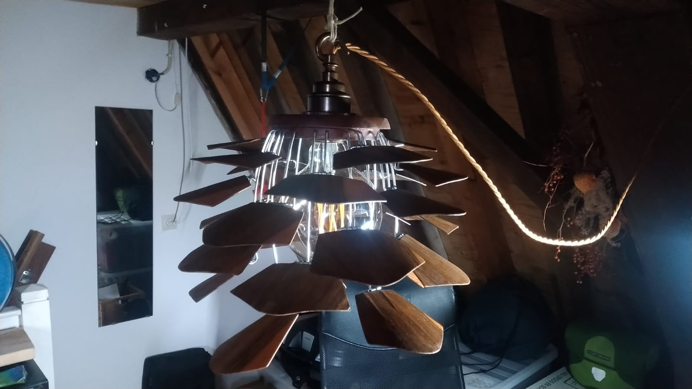

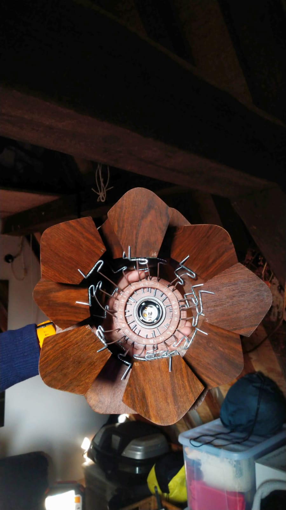

**De lamp is klaar!** De stationaire kraan heb ik in een avondje in elkaar gebeund, maar daar komt later nog wel een echte oplossing voor.
Hij is nu, dankzij de gepatenteerde strop om de radiatorbuis, zowel in hoogte verstelbaar als dat hij kan draaien. De lamp is ook dimbaar en geeft echt heel mooi licht. Ik ben blij met het resultaat! Het creëert een mooie lees hoek in de kamer en de lamp heeft een winter achtige uitstraling.

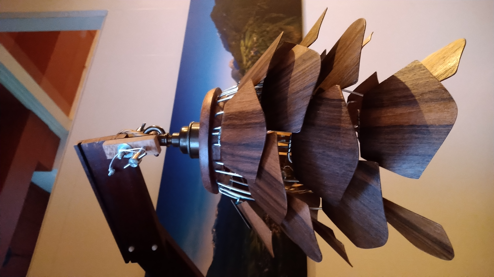
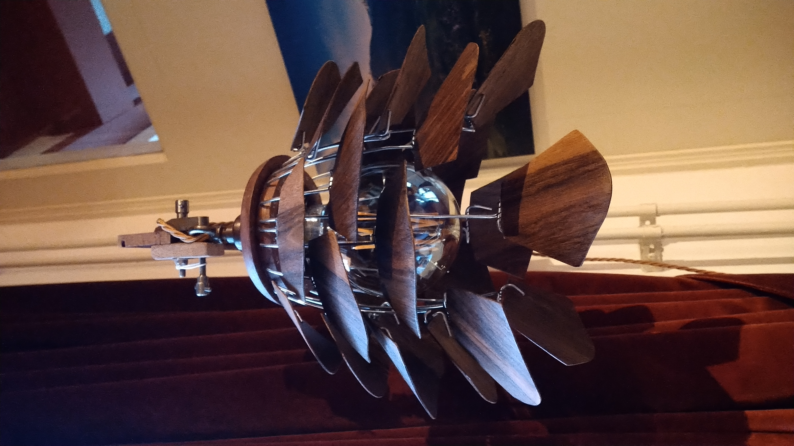
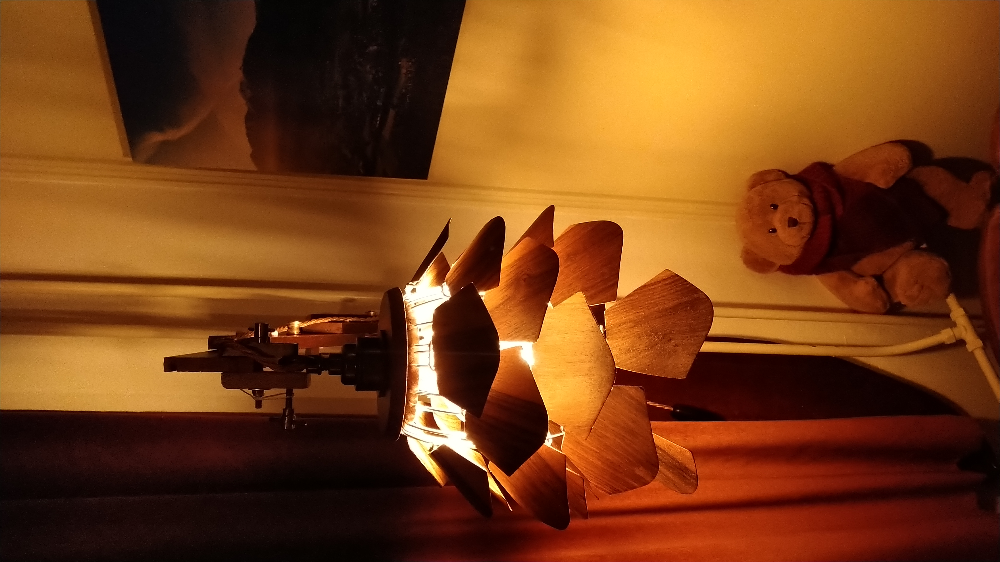
